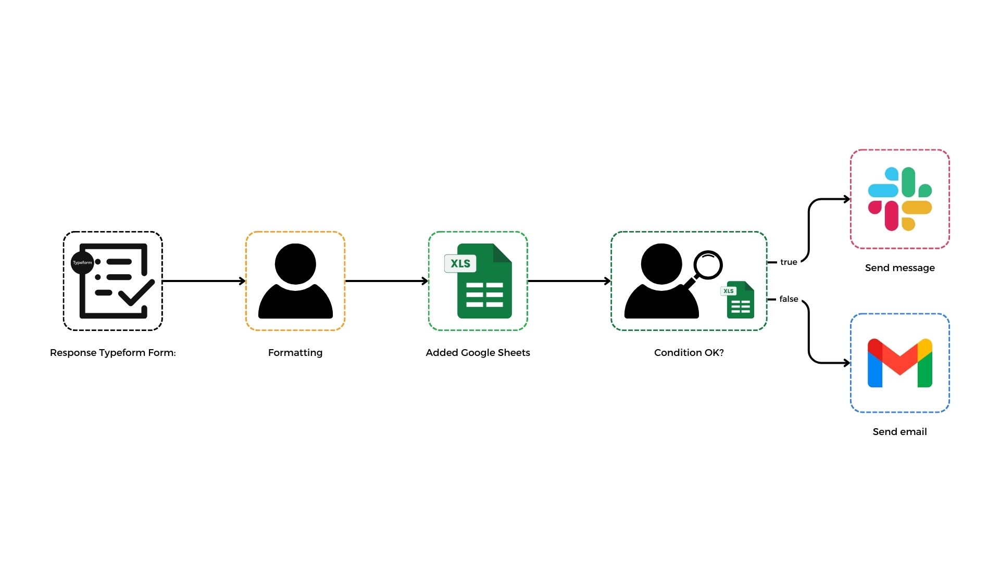
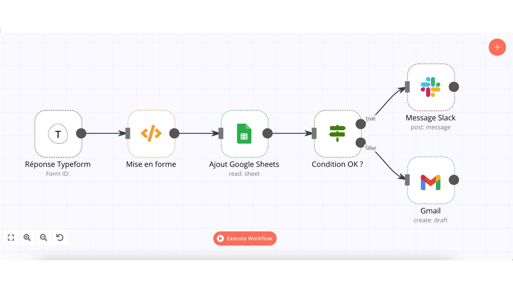
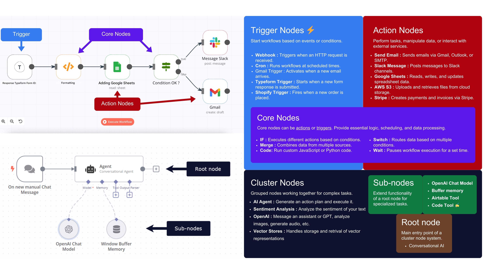
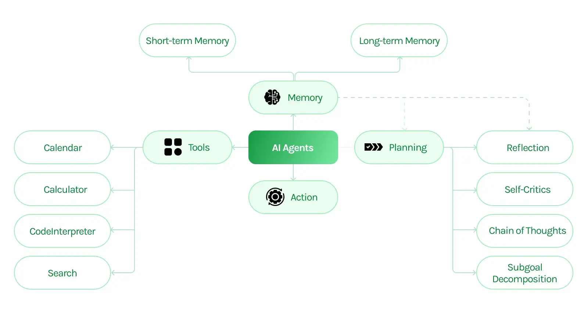

<!-- Slide 1 -->
# Automation & AI Automation  
### with n8n  
#### Stanford Continuing Studies Tech AI Class  
**Presenter:** Myself  
**Date:** MM/DD/2025

---

<!-- Slide 2 -->
# Agenda

| Order | Topic                                                    | Order | Topic                                                   |
|-------|----------------------------------------------------------|-------|---------------------------------------------------------|
| 1     | What Is Automation?                                      | 8     | Key Integrations & Categories                           |
| 2     | Zapier, Make, and n8n: A Comparison                        | 9     | Quick Check: Your Automation Experience                 |
| 3     | Why is n8n now as powerful as ever?                      | 10    | Understanding Workflow Architecture                     |
| 4     | Essential Technical Terms Explained                      | 11    | Real-World Use Case: AI Chatbot with RAG Data Source      |
| 5     | How n8n Works: A High-Level Overview                     | 12    | Top-Rated Useful Workflows for Business Owners           |
| 6     | Key Features of n8n                                      | 13    | Q&A & Next Steps                                        |
| 7     | AI Agents Node Explained                                 |       |                                                         |

---

<!-- Slide 3 -->
# What Will You Learn?  
- How automation frees you from repetitive tasks  
- Why n8n is a powerful, low-code solution  
- The mechanics behind workflows and integrations  
- Actionable insights and real-world examples you can try

---

<!-- Slide 4 -->
# Prerequisites  
- **No Coding Expertise Required**  
- A willingness to experiment and learn  
- A laptop with a web browser (optional: free n8n Cloud account)  
- An open mind to see how automation can transform your business

---

<!-- Slide 5 -->
# What Is Automation?  
- **Automation:** Streamlining repetitive tasks  
- **Benefits:**  
  - **Efficiency:** Tasks are done faster  
  - **Accuracy:** Reduced human error  
  - **Scalability:** Easily expand operations  
- **AI Automation:** Infuses smart decision-making and analysis into routine processes

---

---

---

<!-- Slide 6 -->
# Zapier, Make, and n8n: A Comparison

<!-- | **Feature**         | **Zapier**                                   | **Make**                                      | **n8n**                                                        |
|---------------------|----------------------------------------------|-----------------------------------------------|----------------------------------------------------------------|
| **Ease of Use**     | Very user-friendly, simple setup             | Visually powerful but with a learning curve    | Intuitive and flexible; low-code but may need technical insight  |
| **Cost & Scalability** | Can become expensive at high volumes           | More affordable for complex workflows         | Open source & self-hostable; cost-effective for scaling          |
| **Customization**   | Limited beyond pre-built integrations         | Good visual tools with some custom code options | Highly customizable with custom code and advanced AI integrations| -->

---

<!-- Slide 7 -->
# Why is n8n now as powerful as ever?  
- **Legacy Meets Innovation:**  
  - Automation has streamlined workflows for decades.  
- **AI-Enhanced Capabilities:**  
  - Modern AI integration processes unstructured data and supports intelligent decision-making.  
- **n8n’s Evolution:**  
  - New AI nodes and LangChain support enable dynamic, context-aware workflows.  
- **Real-World Impact:**  
  - Achieve personalized customer interactions, real-time insights, and automated decision support—all without needing to be a tech expert.

---

<!-- Slide 8 -->
# Essential Technical Terms Explained  
- **API (Application Programming Interface):**  
  - A set of rules that allows different software systems to communicate.  
- **Webhook:**  
  - A way for one application to send real-time data to another when an event occurs.  
- **Node:**  
  - A single step in a workflow that performs a specific task.  
- **Workflow:**  
  - The complete automation process, comprised of interconnected nodes.

---

<!-- Slide 9 -->
# How n8n Works: A High-Level Overview  
- **Workflow Concept:**  
  - A workflow is a series of connected “nodes” (steps) that pass data along.  
- **Nodes & Connections:**  
  - Each node performs a specific task (e.g., fetching data, transforming it, or sending notifications).  
  - Connections determine how data flows from one node to the next.  
- **Execution Flow:**  
  - Trigger → Processing → Action → Output  
- **User-Friendly Interface:**  
  - Visual editor lets you see and adjust the entire process without writing extensive code.

---

---

<!-- Slide 10 -->
# Key Features of n8n  
- **Drag-and-Drop Editor:**  
  - Build workflows visually and intuitively.  
- **Extensive Node Library:**  
  - Over 200 built-in integrations for tools you already use.  
- **Custom Code Support:**  
  - Add JavaScript/Python for bespoke logic where needed.  
- **Error Handling & Debugging:**  
  - Monitor executions and easily troubleshoot issues.  
- **AI Integration:**  
  - Leverage AI nodes for natural language processing, decision support, and more.

---

<!-- Slide 11 -->
# AI Agents Node Explained  
- **What It Is:**  
  - A specialized node that is capable of autonomously performing (AI) tasks.  
- **Key Features:**  
  - **Integration with LLMs:** Connects with powerful language models for natural language understanding.  
  - **Contextual Awareness:** Retains context across interactions for more meaningful decision-making. 
  - **Tools:** n8n provides tools for data analysis, text processing, and more.
  - **Multi-Step Processing:** Orchestrates complex tasks by breaking them into simpler steps.  
- **Benefits:**  
  - **Low-Code AI Integration:** Add advanced AI capabilities without writing heavy code.  
  - **Enhanced Decision Support:** Automatically analyze data and provide actionable insights.  
  - **Increased Efficiency:** Streamlines tasks like data summarization and customer interactions, saving time and reducing manual effort.

---

---

<!-- Slide 12 -->
# Key Integrations & Categories  
n8n connects to a wide range of services:  
- **Communication:**  
  - Email, Slack, Microsoft Teams, Discord  
- **Data & Productivity:**  
  - Google Sheets, Airtable, Notion, Excel  
- **Social Media & Marketing:**  
  - YouTube, Twitter, Facebook, LinkedIn  
- **Cloud & Storage:**  
  - Google Drive, Dropbox, AWS S3  
- **Custom & API Integrations:**  
  - Easily connect to any service with REST APIs

---

<!-- Slide 13 -->
# Quick Check: Your Automation Experience  
- **Question 1:** Have you used any automation tools before?  
- **Question 2:** What’s the most repetitive task in your business? 

---

<!-- Slide 14 -->
# Understanding Workflow Architecture  
- **Structure:**  
  - **Trigger Node:** Initiates the workflow (manual, schedule, webhook).  
  - **Processing Nodes:** Transform or manipulate data (API calls, filters, code nodes).  
  - **Action Nodes:** Execute an action (send email, post to Slack, update a database).  
- **Data Flow:**  
  - Data moves seamlessly from node to node, following defined paths and conditions.  
- **Visual Representation:**  
  - Think of it as a flowchart where each step depends on the previous one, ensuring automation from start to finish.

---

<!-- Slide 15 -->
# Real-World Use Case: AI Chatbot with RAG Data Source  
<!-- **Scenario:**  
- A business aims to offer instant, context-rich customer support via an AI chatbot.  

**Challenge:**  
- Customer queries require accurate, up-to-date answers drawn from a vast, unstructured data source.  

**Solution:**  
- Build an AI Chatbot in n8n that leverages a Retrieval Augmented Generation (RAG) workflow:  
  - **Trigger:** User sends a query via the chatbot.  
  - **RAG Module:** Retrieve relevant information from a connected datasource (e.g., vector database of documents).  
  - **AI Processing:** Synthesize and refine the response using integrated AI nodes.  

**Outcome:**  
- Delivers accurate, real-time responses that enhance customer engagement and reduce support costs. -->

---

<!-- Slide 16 -->
# Top-Rated Useful Workflows for Business Owners  
**Here are some of the best-rated workflows that business owners have found invaluable:**

1. **Sales Reporting Automation:**  
   - Aggregates data from legacy systems and sends out weekly summaries  
   - *Real Impact:* Reduces errors and saves significant manual effort  
   
2. **Customer Support Chatbot:**  
   - Uses AI to answer common customer inquiries automatically  
   - *Real Impact:* Improves response times and frees up team resources  
   
3. **Lead Enrichment & Verification:**  
   - Integrates with CRM systems to verify and enrich lead data automatically  
   - *Real Impact:* Enhances sales efficiency and data quality  
   
4. **Social Media & Email Campaign Automation:**  
   - Automates posting, follow-ups, and engagement tracking across channels  
   - *Real Impact:* Streamlines marketing efforts and drives consistent outreach  
   
5. **Data Extraction & Analysis:**  
   - Extracts key insights from unstructured data (e.g., customer reviews or web content)  
   - *Real Impact:* Informs strategic decisions and identifies market trends

*These workflows have been featured and highly rated in community discussions and case studies.*

---

<!-- Slide 20 -->
# Interactive Demo  
- **Live Walk-Through:** Watch a live demonstration of the workflow  
- **Q&A:** Ask questions as and after we build the workflow  
- **Tip:** Use our provided sample data to get started quickly

---

<!-- Slide 21 -->
# Design Tips for Success  
- **Keep It Simple:** Focus on one task at a time  
- **Visualize Your Data:** Use clear charts and summaries  
- **Iterate:** Test, tweak, and improve your workflow  
- **Leverage Community Resources:** n8n Docs, Tutorials, and Forums are gold mines!

---

<!-- Slide 22 -->
# Key Takeaways  
- Automation isn’t just for techies—it’s a strategic tool for any business owner  
- n8n is the best choice for a powerful automation platform
- Real use cases translate into immediate, tangible benefits  
- Tonight, you will start building automation workflows that solve real problems

---

<!-- Slide 23 -->
# Next Steps  
- **Practice:** Build your own workflow using the demo project as inspiration  
- **Explore:** Dive into n8n’s tutorials and community for more advanced ideas  
- **Scale:** Host your own n8n Cloud instance for unlimited automation power
- **Resources:**  
  - [n8n Documentation](https://docs.n8n.io)  
  - [n8n Community Forum](https://community.n8n.io)  
  - Free n8n Cloud Account Signup + 100 Free OpenAI Credits

---

<!-- Slide 24 -->
# Q&A  
**Any Questions?**  
Let’s discuss how automation can be tailored to your projects and business needs.

---

<!-- Slide 25 -->
# Thank You!  
**We’re Here to Help You Innovate**  
*For further information and support, reach out at [Your Email/Contact].*  
[Optional: Include your company logo and social media handles]  
**Let's build the future of your business together!**
